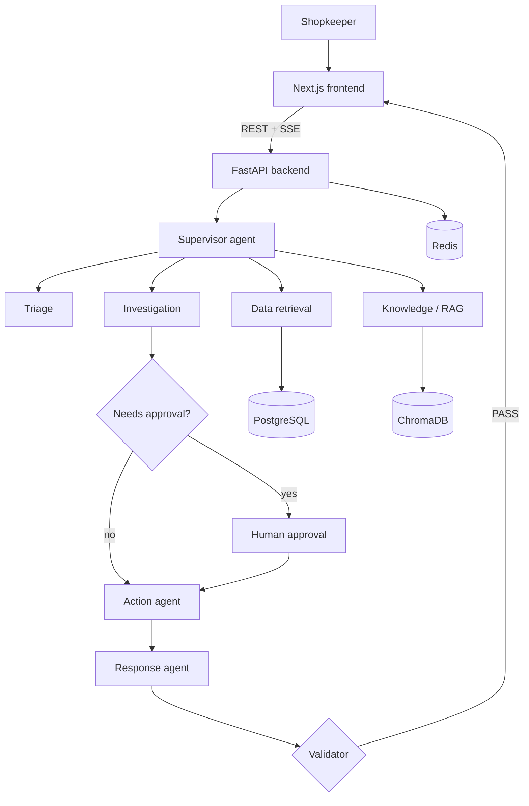

# ORM_AI

A multi-agent AI assistant that helps local shopkeepers keep their records organised and detailed.

> **Status:** Phases 0–3 are done: the API foundations, 24 database tables with migrations, 91 days of synthetic shop data with 17 planted edge cases, 33 knowledge-base documents, 21 typed tools with approvals, idempotency and failure injection, and knowledge search (RAG) with citations. The agents (Phase 4) come next. See [Roadmap](#roadmap).
>
> **New here? Read [docs/how-it-works.md](docs/how-it-works.md) first.**

## Problem statement

Local shops in the area run on memory, notebooks and scattered WhatsApp messages. Stock counts drift, supplier orders are placed late, customer credit (*udhaar*) is hard to track, and nothing is easy to look up later.

ORM_AI gives shopkeepers one assistant that:

- answers questions about stock, sales, suppliers and customer credit from the shop's own records
- checks the shop's rules (credit limits, supplier terms, pricing) and cites them
- drafts actions such as reorders, payment reminders and price updates
- asks the shopkeeper before anything that moves money or stock

**Primary users:** owners and staff of local shops.
**Working scope:** stock, sales, supplier orders and customer credit (*udhaar*). Each shop sees only its own records; suppliers are shared by all shops.

## Architecture (target)



## Tech stack

| Layer | Tools |
| --- | --- |
| Frontend | Next.js 16 (App Router), TypeScript, Tailwind CSS 4 |
| Backend | Python 3.12, FastAPI, Pydantic v2, structlog |
| Agents | LangGraph + LangChain (Phase 4), OpenAI API |
| Data | PostgreSQL 17 (Docker locally, or [Supabase](docs/supabase.md)), SQLAlchemy 2.1, Alembic, Redis 7, ChromaDB |
| Quality | Pytest, Ruff, ESLint, GitHub Actions, pre-commit |
| Deploy | Docker, Vercel (frontend), Render or Railway (backend) |

## Folder structure

```
ORM_AI/
├── backend/
│   ├── app/
│   │   ├── main.py            FastAPI app: middleware, error handlers, routers
│   │   ├── api/               routers: /health, /knowledge/search
│   │   ├── config/            settings loaded from .env
│   │   ├── core/              logging, request-ID middleware, error handling
│   │   ├── models/            24 tables (shop.py, platform.py), engine, API schemas
│   │   ├── seed/              synthetic data: catalog, 91-day simulator, loader
│   │   ├── tools/             21 typed tools, registry, mock external APIs
│   │   ├── services/          health checks, Redis, LLM and memory services
│   │   ├── agents/            8 agents (placeholders until Phases 4–5)
│   │   ├── graph/             LangGraph state, nodes, edges, workflow
│   │   ├── rag/               knowledge search: loaders, chunking, embeddings, ChromaDB, retriever
│   │   └── prompts/           one prompt per agent, fixed structure
│   ├── migrations/            Alembic migrations (schema history)
│   ├── tests/                 pytest suite
│   ├── scripts/               seed.py, ingest.py (embed documents), eval_retrieval.py
│   ├── data/seed/             EDGE_CASES.md and a CSV export of every table
│   ├── knowledge_base/        33 policies, procedures, supplier terms, FAQs, shop profiles
│   ├── evaluation/            test sets (retrieval now, agents in Phase 8) and reports
│   ├── Dockerfile
│   ├── requirements.txt / requirements-dev.txt
│   └── pyproject.toml         Ruff and pytest settings
├── frontend/
│   └── src/
│       ├── app/               pages: /, /chat, /approvals, /admin
│       ├── components/        SiteHeader, BackendStatus, ComingSoon
│       ├── lib/api.ts         backend client (uses NEXT_PUBLIC_API_URL)
│       └── types/api.ts       response types
├── docs/                      how it works, database, tools, RAG, Supabase guides
├── docker/postgres/init/      creates the test database on first start
├── .github/workflows/ci.yml   lint, tests and build on every push
├── docker-compose.yml         Postgres, Redis and the backend
└── .env.example               every setting, documented
```

## Prerequisites (Windows)

- [Python 3.12](https://www.python.org/downloads/windows/) (3.12.10 is the last 3.12 with a Windows installer; tick "Add python.exe to PATH")
- [Node.js](https://nodejs.org/) LTS, version 20.9 or newer
- [Docker Desktop](https://www.docker.com/products/docker-desktop/)
- [Git](https://git-scm.com/download/win)

## Run it locally

All commands are for PowerShell, from the project root.

**1. Create your `.env`**

```powershell
Copy-Item .env.example .env
```

Change `POSTGRES_PASSWORD`, and set the same password inside `DATABASE_URL`.

**2. Start PostgreSQL and Redis**

```powershell
docker compose up -d postgres redis
docker compose ps        # both should say "healthy"
```

**3. Set up the backend, create the tables and load the shops**

```powershell
cd backend
python -m venv .venv
.\.venv\Scripts\Activate.ps1
pip install -r requirements-dev.txt
alembic upgrade head          # creates the 24 tables
python -m scripts.seed        # loads the synthetic shops
python -m scripts.ingest      # embeds the knowledge base (needs OPENAI_API_KEY in .env)
uvicorn app.main:app --reload
```

No OpenAI key yet? `python -m scripts.ingest --embedding-model hash` and `EMBEDDING_MODEL=hash` in `.env` run the knowledge search offline.

- Health check: <http://localhost:8000/api/health> should return `"status": "ok"`.
- API docs: <http://localhost:8000/docs> (try `GET /api/knowledge/search` there)

If PowerShell blocks `Activate.ps1`, run `Set-ExecutionPolicy -Scope CurrentUser RemoteSigned` once.

**4. Start the frontend** (in a second terminal)

```powershell
cd frontend
Copy-Item .env.example .env.local
npm install
npm run dev
```

Open <http://localhost:3000>. The Backend status card should say **All systems up**.

**Or run the whole backend stack in Docker** (migrations run automatically on start)

```powershell
docker compose up --build
docker compose exec backend python -m scripts.seed
```

**Using Supabase instead of Docker Postgres?** See [docs/supabase.md](docs/supabase.md).

## Tests and checks

```powershell
cd backend
pytest                 # 177 tests, no API key needed (+1 PostgreSQL test when TEST_DATABASE_URL is set)
ruff check .
ruff format --check .

cd ..\frontend
npm run lint
npm run typecheck
npm run build
```

GitHub Actions runs all of these on every push and pull request (`.github/workflows/ci.yml`).

## Working with Git

The repository is <https://github.com/maharshi566/ORM_AI>. From the project root:

```powershell
git pull                          # get the latest changes first
git add .
git commit -m "Describe the change"
git push                          # GitHub Actions then runs every check
```

Optional: `pre-commit install` (with the backend's `.venv` active) runs Ruff and other checks on every commit.

## API (so far)

| Method | Path | Description |
| --- | --- | --- |
| GET | `/api/health` | 200 when PostgreSQL and Redis answer, 503 with details when one is down |
| GET | `/api/knowledge/search?q=…` | Search the shop's documents; returns passages with citations ([docs/rag.md](docs/rag.md)) |

Every response carries an `X-Request-ID` header, and every error uses one shape:

```json
{ "error": { "code": "not_found", "message": "Not Found", "request_id": "…", "details": null } }
```

## Roadmap

| Phase | Weeks | What gets built |
| --- | --- | --- |
| **0 Foundations** | 1 | Repo, config, logging, health check, Docker, CI ✅ |
| **1 Data + docs** | 2 | Database tables, Alembic, synthetic shop data, knowledge-base documents ✅ |
| **2 Tools** | 3 | Typed read and action tools with mock APIs and failure injection ✅ |
| **3 RAG** | 4–5 | Chunking, embeddings, ChromaDB, hybrid retriever, reranker, citations ✅ |
| 4 Agent graph | 6–7 | LangGraph state graph, 8 agents, Postgres checkpointer, `/api/chat` |
| 5 Approval + guardrails | 8 | Policy gate, `interrupt()` approval, validator, input guardrails |
| 6 API | 9 | All endpoints, SSE progress stream, rate limits, uploads |
| 7 Frontend | 10 | Chat, workflow, sources, approval and admin pages |
| 8 Evaluation | 11 | 40-case evaluation set, metrics, tracing, report |
| 9 Deploy | 12 | Vercel + Render/Railway, full README, demo |

## Security notes

- Secrets live only in `.env` (git-ignored). The frontend gets `NEXT_PUBLIC_API_URL` and nothing else.
- Logs mask keys that look like passwords, tokens or API keys.
- Health errors show only the exception type, never hosts or credentials.
- Tools are scoped to the caller's shop; consequential actions need a recorded approval; every action is idempotent and audit-logged ([docs/tools.md](docs/tools.md)).
- Retrieved documents are treated as data, never instructions: outside material is excluded by default, passages are wrapped and labelled, and instruction-like text is flagged ([docs/rag.md](docs/rag.md)).
- Row Level Security is enabled on every table, so Supabase's public Data API cannot read them.
- `npm install` reports advisories in ESLint's dependencies. They affect lint tooling, not the app. Don't run `npm audit fix --force`: it downgrades Next.js.
