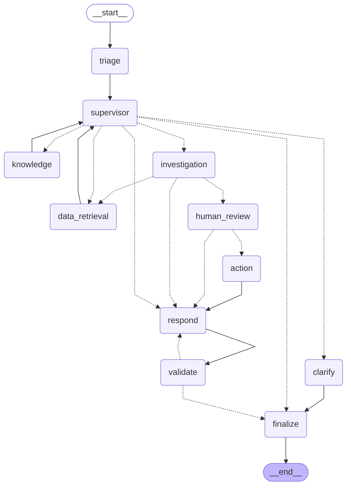

# The agent graph

Drawn from the code by `python -m scripts.draw_graph --write`; do not edit by hand.
Solid arrows always happen; dotted arrows are decisions (conditional edges). The
supervisor is the hub that every specialist reports back to. See
[agents.md](agents.md) for what each node does.

