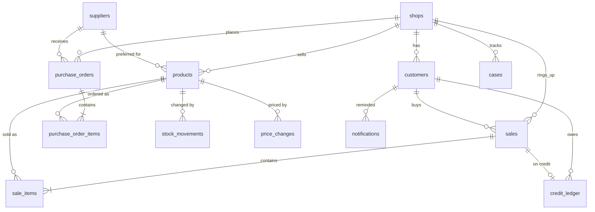

# Database, synthetic data and migrations

## Tables

### Shop records (the business data)



| Table | One row is | Key columns |
| --- | --- | --- |
| `shops` | a shop | `shop_type`, `owner_name`, `locality` |
| `suppliers` | a wholesaler, shared by all shops | `lead_time_days`, `payment_terms_days`, `min_order_value` |
| `customers` | a customer of one shop | `credit_allowed`, `credit_limit`, `customer_type` |
| `products` | an item one shop sells | `cost_price`, `selling_price`, `mrp`, `stock_qty`, `reorder_level`, `preferred_supplier_id` |
| `sales` / `sale_items` | a bill and its lines | `payment_mode` (cash, upi, card, credit), `status` (completed, returned) |
| `purchase_orders` / `purchase_order_items` | an order to a supplier and its lines | `status` (draft, placed, partially_received, received), `expected_on` |
| `stock_movements` | one change to stock (+ adds, − removes) | `movement_type`, `quantity`, `reason` |
| `credit_ledger` | one credit entry (+ owes more, − paid) | `entry_type`, `amount`, `due_on` |
| `price_changes` | one price or cost change | `field`, `old_value`, `new_value`, `approved_by` |
| `notifications` | a message sent to a customer or supplier | `purpose`, `channel`, `status` |
| `cases` | a problem and how it was resolved | `category`, `status`, `resolution` |

Action tables (`purchase_orders`, `stock_movements`, `credit_ledger`,
`price_changes`, `notifications`) have a unique `idempotency_key`, which is how
the action tools refuse to do the same thing twice.

### Platform records (the AI's own memory)

| Table | Used from | Holds |
| --- | --- | --- |
| `users` | now | shop owners and staff (`USR-001` ...), with a role |
| `sessions`, `messages` | Phase 4 | conversations (short-term memory) |
| `workflows`, `agent_runs` | Phase 4 | each request's run through the agent graph, step by step |
| `tool_calls` | now | every tool call: arguments, result, status, latency |
| `documents`, `document_chunks` | now | the knowledge base after chunking (written by `python -m scripts.ingest`; the vectors themselves live in ChromaDB) |
| `approvals` | Phase 5 | actions waiting for, or decided by, a person |
| `audit_logs` | now | who changed what, and who approved it |
| `evaluations` | Phase 8 | evaluation results |

### Conventions

- **IDs** for shop records are readable (`CUST-0001`, `PO-00062`), because the
  agents quote them to people. Log tables use numbers.
- **Money** is `Numeric(12, 2)`, never float.
- **Enums** are stored as text plus a CHECK constraint (for example
  `ck_sales_payment_mode`). Adding a value later is a normal migration.
- **Times** are stored with time zone. The tools convert them to IST.
- **Row Level Security** is enabled on every table (see [supabase.md](supabase.md)).
  It does not affect the app, which connects as the table owner.

## Migrations (Alembic)

The models in `backend/app/models/` are the source of truth. Alembic turns
changes to them into migration files in `backend/migrations/versions/`, and
applies those to the database in order.

| Command (from `backend/`) | What it does |
| --- | --- |
| `alembic upgrade head` | Bring the database up to date |
| `alembic downgrade -1` | Undo the last migration |
| `alembic revision --autogenerate -m "add x"` | Compare the models with the database and write the difference as a new migration |
| `alembic current` / `alembic history` | Show where the database is / list migrations |

There are two migrations so far:

1. `initial schema`: all 24 tables.
2. `enable row level security on every table`: needed for Supabase; harmless elsewhere.

When you add a model:

1. Add the class in `models/shop.py` or `models/platform.py`, and export it in
   `models/__init__.py`.
2. Run `alembic revision --autogenerate -m "..."` and **read the file it writes**.
3. Add `ALTER TABLE ... ENABLE ROW LEVEL SECURITY` for the new table (see the
   second migration). The PostgreSQL test fails if you forget.
4. Run `alembic upgrade head`.

`migrations/env.py` has one fix you should know about. SQLAlchemy 2.1 changed
how enum CHECK constraints are marked, so Alembic would write each one three times
and the migration would fail. The `render_item` hook skips the duplicates.

## Synthetic data

| Command (from `backend/`) | What it does |
| --- | --- |
| `python -m scripts.seed` | Load the data into an empty database |
| `python -m scripts.seed --reset` | **Wipe every table** and load again |
| `python -m scripts.seed --dry-run` | Generate and check, without writing |
| `python -m scripts.seed --export-dir data/seed/csv` | Also write one CSV per table |

What you get with the default seed (42) and "today" = 2026-09-30:

| Records | Count |
| --- | --- |
| Shops / suppliers / users | 50 / 12 / 101 |
| Customers | 1,038 |
| Products | 1,256 |
| Bills / bill lines | 5,672 / 12,308 |
| Purchase orders / order lines | 587 / 613 |
| Stock movements | 14,678 |
| Credit ledger entries | 1,545 |
| Price changes / notifications | 238 / 124 |
| Historical cases | 150 |
| Planted edge cases | 17, all in SHOP-001 to SHOP-005 (see `data/seed/EDGE_CASES.md`) |

The 50 shops are 15 kirana stores, 10 dairies and bakeries, 9 hardware stores, 8
stationery shops and 8 mobile accessories shops, in 20 localities. Each has one owner and
one staff user (the 101st user is an admin). A shop has between 12 and 30 customers, 22
to 29 products and, over the 91 days, between about 26 and 223 bills, depending on its
size. The shop list lives in `backend/app/seed/catalog.py`: to add or change a shop, edit
it there, then run `python -m scripts.generate_shop_profiles` and `python -m scripts.seed
--reset`, and `python -m scripts.ingest` (see [rag.md](rag.md)).

Important details:

- **Deterministic.** The same `--seed` and `--anchor` always give identical data.
  Changing the generator's code can change the data, because it can change how
  many random numbers are drawn. If you edit the generator, re-run the seed and
  re-export the CSVs.
- **"Today" is frozen** at 2026-09-30 by `BUSINESS_DATE` in `.env`, so "days
  overdue" match the edge cases. Remove it when you use real data.
- **Fake phone numbers** all follow `+91-00000-xxxxx`, so none can belong to a
  real person.
- **Tests never touch your database.** They build their own SQLite copy.
- **One shop never sees another.** Every shop record carries a `shop_id`, and the tools take
  the shop from the logged-in user, never from what the AI asks for. A test checks
  that every record points to a customer, product or bill of the same shop.

## Look inside the database

You can open the tables and read the rows yourself. Use whichever of these suits you;
all of them need the database running (`docker compose up -d postgres redis`).

The connection details are the same everywhere:

| Setting | Value |
| --- | --- |
| Host | `localhost` |
| Port | `5432` (or your `POSTGRES_PORT`) |
| Database | `orm_ai` |
| User | `orm_ai` |
| Password | the `POSTGRES_PASSWORD` line in your `.env` (`change_me_local_only` if you kept the example) |

**1. Adminer, in your browser (nothing to install).** In the project's top folder:

```powershell
docker compose --profile tools up -d adminer
```

Open <http://localhost:8080>. Choose **PostgreSQL** in the *System* box, put `postgres` in
*Server* (that is the name of the database container, not `localhost`), then the user,
password and database from the table above, and click **Login**. This address fills in
everything but the password: <http://localhost:8080/?pgsql=postgres&username=orm_ai&db=orm_ai>.
In the left list click a table name, then **Select data** to see rows, or **SQL command** to
type a query. When you are done: `docker compose stop adminer`.

**2. Cursor.** Cursor has no database window of its own; Adminer (above) or DBeaver
(below) is the easy way. If you would rather stay inside Cursor, a database extension from
the Extensions panel (Ctrl+Shift+X, search "PostgreSQL") works with the same details.

**3. DBeaver (free desktop app, <https://dbeaver.io>).** **Database → New Database
Connection → PostgreSQL**, fill in the table above, **Test Connection** (it offers to download
the driver), **Finish**.

**4. The terminal, with nothing extra installed.**

```powershell
docker compose exec postgres psql -U orm_ai -d orm_ai
```

At the `orm_ai=#` prompt: `\dt` lists the tables, `\d shops` shows one table's columns, a
query ends with `;`, and `\q` quits. For a single answer without entering the prompt:

```powershell
docker compose exec postgres psql -U orm_ai -d orm_ai -c "SELECT count(*) FROM shops;"
```

**5. Supabase.** If you use Supabase instead of Docker, open your project's **Table Editor**
(rows) or **SQL Editor** (queries) in the Supabase dashboard.

### Some queries to try

```sql
-- How many shops of each kind?
SELECT shop_type, count(*) FROM shops GROUP BY shop_type ORDER BY 2 DESC;

-- Which products in SHOP-001 are at or below their reorder level?
SELECT name, stock_qty, reorder_level FROM products
WHERE shop_id = 'SHOP-001' AND stock_qty <= reorder_level ORDER BY name;

-- The five customers who owe the most (credit balance = sum of ledger entries)
SELECT c.name, c.shop_id, sum(l.amount) AS balance
FROM credit_ledger l JOIN customers c ON c.id = l.customer_id
GROUP BY c.id, c.name, c.shop_id ORDER BY balance DESC LIMIT 5;

-- The busiest shops by number of bills
SELECT s.id, s.name, count(*) AS bills
FROM sales x JOIN shops s ON s.id = x.shop_id
GROUP BY s.id, s.name ORDER BY bills DESC LIMIT 5;

-- Shops with the most purchase orders still on their way
SELECT s.name, count(*) AS open_orders
FROM purchase_orders p JOIN shops s ON s.id = p.shop_id
WHERE p.status IN ('placed', 'partially_received')
GROUP BY s.name ORDER BY open_orders DESC LIMIT 5;
```

Look, but do not edit rows by hand: stock and credit are ledgers, and the app expects
their totals to match their entries. If you change something by accident, restore the
original data with `python -m scripts.seed --reset` (this wipes every table first).
