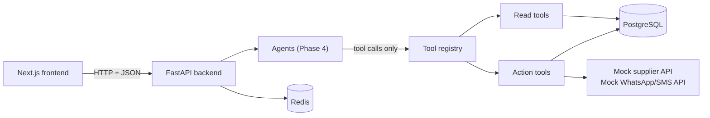
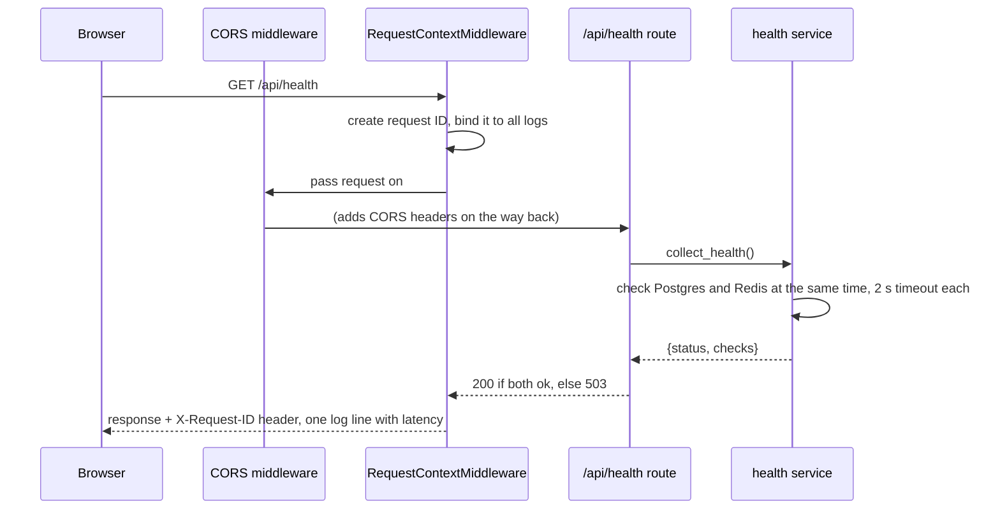
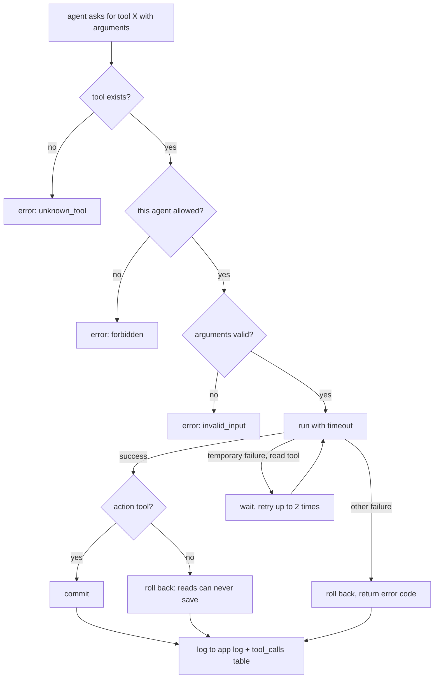

# How ORM_AI works (Phases 0–2)

This guide explains what is built so far and how the pieces fit together. Read it
top to bottom once. After that, use the other guides as references:

- [database.md](database.md): the tables, how the synthetic data is made, migrations
- [tools.md](tools.md): every tool the agents can call, and the rules they enforce
- [supabase.md](supabase.md): using Supabase as the database

## 1. The big picture

ORM_AI is a backend (FastAPI, Python) and a frontend (Next.js), with PostgreSQL
for records and Redis for short-lived data. The AI part (Phases 4–5) is a set of
agents that **never touch the database directly**: they call typed **tools**, and
the tools enforce the shop's rules.



Built so far:

| Phase | What it gives you | Where it lives |
| --- | --- | --- |
| 0 Foundations | A running API with config, logging, request IDs, error handling, health check, Docker, tests, CI | `backend/app/main.py`, `core/`, `config/` |
| 1 Data | 24 database tables, migrations, 91 days of synthetic shop data, 33 policy documents | `models/`, `migrations/`, `seed/`, `knowledge_base/` |
| 2 Tools | 20 typed tools (13 read, 7 action), with approvals, idempotency, retries and logging | `tools/` |

## 2. What happens when a request comes in (Phase 0)

Take `GET /api/health` as the example. The same path applies to every endpoint
added later.



The files, in the order a request touches them:

1. **`app/main.py`** builds the app with `create_app()`. On startup (`lifespan`) it
   creates the database engine and the Redis client. On shutdown it closes them.
2. **`app/core/middleware.py`** gives each request an ID. It reuses the caller's
   `X-Request-ID` if it is safe, otherwise it makes a new one. It returns the ID in
   the response header and logs one line per request with the status and how long
   it took.
3. **`app/api/router.py`** mounts every route under `/api`.
4. **`app/api/routes/health.py`** is the endpoint. It only calls the service and
   picks the status code.
5. **`app/services/health.py`** does the real work: it runs both checks in
   parallel, times each one, and reports only the error type (never hosts or
   passwords).
6. **`app/core/exceptions.py`** turns any error into the same JSON shape:
   `{"error": {"code", "message", "request_id", "details"}}`. A crash becomes a
   generic 500 with no internal details.
7. **`app/core/logging.py`** formats logs: readable in a terminal, JSON in Docker.
   Any field whose name looks like a password, token or key is masked.
8. **`app/config/settings.py`** reads every setting from `.env`. Nothing secret is
   hard-coded.

## 3. The data (Phase 1)

### What is stored

There are two groups of tables (details in [database.md](database.md)):

- **Shop records:** shops, customers, suppliers, products, sales and their items,
  purchase orders and their items, stock movements, the credit ledger (khata),
  price changes, notifications and cases.
- **Platform records:** what the AI does. These are users, chat sessions,
  messages, workflows, agent runs, tool calls, documents and chunks, approvals,
  audit logs and evaluations.

Two design rules keep the numbers trustworthy:

- **Stock is a ledger.** Every change to stock is a row in `stock_movements`
  (opening, sale, delivery, return, damage, count adjustment). The `stock_qty` on
  a product always equals the sum of its movements, and a test checks this.
- **Credit is a ledger too.** Buying on credit adds a positive row to
  `credit_ledger`, and paying adds a negative row. A customer's balance is the sum.
  Mistakes are never deleted; they are corrected with a new entry.

### How the synthetic data is made

`backend/app/seed/generator.py` simulates 91 days of trading for five invented
shops: a kirana store, a hardware store, a stationery shop, a dairy and bakery,
and a mobile accessories shop. Each day it does the following:

1. Each shop rings up a few bills. Products are picked by popularity.
2. Known customers sometimes buy on credit; each credit bill is due in 30 days.
3. Credit customers pay back according to a habit (prompt, regular or slow).
4. Overdue customers get a reminder, at most one every 7 days.
5. Anything at or below its reorder level goes on a purchase order. Orders arrive
   after the supplier's lead time, and a few arrive late or short.
6. Sometimes a supplier raises a price, bakery items expire, or a customer
   returns something.

After the simulation it **plants 17 edge cases**. These are situations the agents
must handle correctly: a customer over their limit, a late cement delivery, ghee
selling below cost, a duplicate UPI payment, and more. They are listed in
`backend/data/seed/EDGE_CASES.md`.

The generator is **deterministic**. The same seed always produces the same
fingerprint, which the tests check, so evaluation answers in Phase 8 can be
exact.

### The knowledge base

`backend/knowledge_base/` holds 33 short Markdown documents: policies, procedures,
supplier terms, FAQs and shop profiles. Every document has front-matter
(`document_id`, `version`, `effective_date`, ...) so that answers can cite it.
They match the data: the credit policy's Rs 3,000 limit and 45-day block are the
rules the credit edge cases test. Two documents exist purely as tests:

- **Credit policy v1** is superseded by v2. Retrieval must prefer v2.
- **A supplier flyer** contains text pretending to be an instruction for AI
  assistants. The agents must treat it as plain information.

## 4. The tools (Phase 2)

A **tool** is a function an agent may call. Each one has:

- a **name** and a **description**, written for the LLM,
- an **input model** (Pydantic). Unknown fields are rejected, so an LLM cannot add
  a `shop_id` to peek at another shop,
- an **output model**, so results always have the same shape,
- a **timeout**, and a **kind**: `read` (looks things up) or `action` (changes
  records).

Every call goes through **`ToolRegistry.call()`** (`tools/registry.py`), which runs
these steps in order:



The result is always a `ToolResult`: `status` is `success` or `error`, plus `data`
or an `error_code`. The registry never raises an exception at the agent, so the
agent can't crash on a tool failure. It also can't make up a result, because the
data only ever comes from the tool.

### Four safety rules, enforced in code rather than in prompts

| Rule | How it is enforced |
| --- | --- |
| A shop sees only its own records | The shop comes from `ToolContext.shop_id` (the logged-in user), never from tool arguments. Another shop's record looks exactly like a missing one. |
| Agents only get the tools they need | `AGENT_TOOLS` in `registry.py`: the Data agent gets read tools, the Action agent gets action tools, every other agent gets none. |
| Consequential actions need a person | Action tools check `ToolContext.approval`. Only the human-approval step (Phase 5) can set it. Thresholds come from the approval matrix: orders over Rs 10,000 need the owner, and so on. |
| Nothing happens twice | Every action carries an `idempotency_key`. Repeating a key returns the first result (`replayed: true`) instead of acting again. |

### Mock external APIs

A real shop would connect to a supplier's ordering system and a WhatsApp/SMS
gateway. `tools/api_tools.py` simulates both. Setting `MOCK_API_FAILURE_MODE` in
`.env` makes them fail on purpose, with `timeout`, `server_error`, `rate_limited`,
`not_found` or `random`. This drives the tool-failure tests now and the
tool-failure evaluation cases in Phase 8.

## 5. How to check everything yourself

From `backend/`, with Docker's Postgres and Redis running:

```powershell
alembic upgrade head            # create the 24 tables
python -m scripts.seed          # load the synthetic shops
pytest                          # 104 tests (+1 that needs TEST_DATABASE_URL)
uvicorn app.main:app --reload   # then open http://localhost:8000/docs
```

To see the data, open `backend/data/seed/csv/*.csv` in Cursor, or connect a
database viewer to `localhost:5432`.

## 6. What comes next

| Phase | Builds on | Adds |
| --- | --- | --- |
| 3 RAG | `knowledge_base/`, `documents` tables | Chunking, embeddings, ChromaDB, a `search_knowledge` tool with citations |
| 4 Agent graph | the tools and their JSON schemas (`registry.schemas_for(agent)`) | LangGraph state graph, the 8 agents, `/api/chat` |
| 5 Approval | `ApprovalGrant`, `approvals` and `audit_logs` tables | Policy gate, pause/resume with `interrupt()`, the validator |
