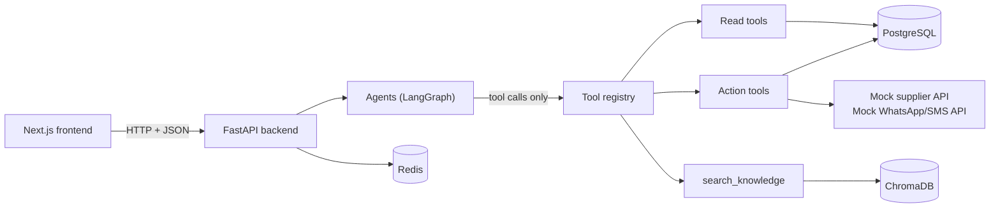
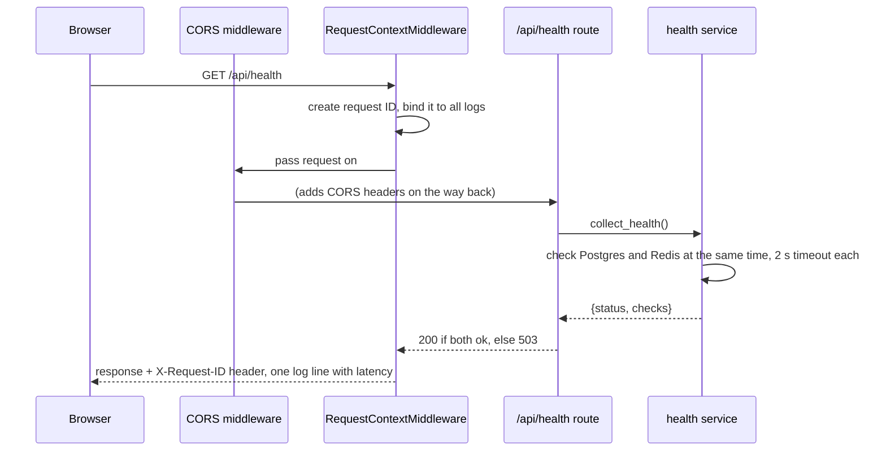
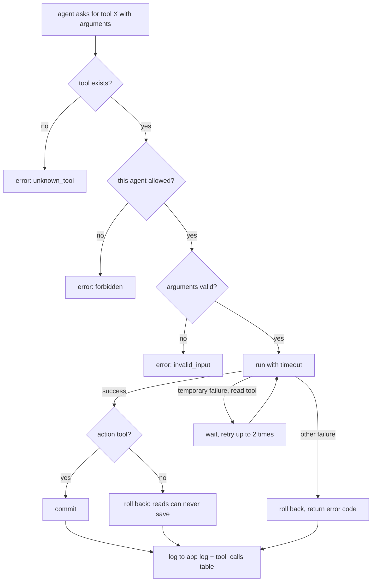

# How ORM_AI works (Phases 0–4)

This guide explains what is built so far and how the pieces fit together. Read it
top to bottom once. After that, use the other guides as references:

- [database.md](database.md): the tables, how the synthetic data is made, migrations
- [tools.md](tools.md): every tool the agents can call, and the rules they enforce
- [rag.md](rag.md): knowledge search, from documents to cited passages
- [agents.md](agents.md): the agents, how a question is answered, and choosing a model
- [supabase.md](supabase.md): using Supabase as the database
- [omniroute.md](omniroute.md): using OmniRoute (or another gateway) instead of a plain OpenAI key

## 1. The big picture

ORM_AI is a backend (FastAPI, Python) and a frontend (Next.js), with PostgreSQL
for records and Redis for short-lived data. The AI part (Phase 4, with approvals in
Phase 5) is a set of agents that **never touch the database directly**: they call typed **tools**, and
the tools enforce the shop's rules.



Built so far:

| Phase | What it gives you | Where it lives |
| --- | --- | --- |
| 0 Foundations | A running API with config, logging, request IDs, error handling, health check, Docker, tests, CI | `backend/app/main.py`, `core/`, `config/` |
| 1 Data | 24 database tables (27 with Phase 4's checkpoint tables), migrations, 91 days of synthetic data for 50 shops, 78 knowledge documents (28 shared, one profile per shop) | `models/`, `migrations/`, `seed/`, `knowledge_base/` |
| 2 Tools | 21 typed tools (13 read, 8 action), with approvals, idempotency, retries and logging | `tools/` |
| 3 Knowledge search | Documents chunked and embedded into ChromaDB; hybrid search with citations; the `search_knowledge` tool; a 20-question evaluation | `rag/`, `scripts/ingest.py`, `evaluation/` |
| 4 Agents | A LangGraph graph of agents (triage, supervisor, data retrieval, knowledge, investigation, response, validator) behind `POST /api/chat`, with checkpoints, conversation memory and a 10-case evaluation | `agents/`, `graph/`, `services/chat_*.py`, [agents.md](agents.md) |

## 2. What happens when a request comes in (Phase 0)

Take `GET /api/health` as the example. The same path applies to every endpoint
added later.



The files, in the order a request touches them:

1. **`app/main.py`** builds the app with `create_app()`. On startup (`lifespan`) it
   creates the database engine and the Redis client. On shutdown it closes them.
2. **`app/core/middleware.py`** gives each request an ID. It reuses the caller's
   `X-Request-ID` if it is safe, otherwise it makes a new one. It returns the ID in
   the response header and logs one line per request with the status and how long
   it took.
3. **`app/api/router.py`** mounts every route under `/api`.
4. **`app/api/routes/health.py`** is the endpoint. It only calls the service and
   picks the status code.
5. **`app/services/health.py`** does the real work: it runs both checks in
   parallel, times each one, and reports only the error type (never hosts or
   passwords).
6. **`app/core/exceptions.py`** turns any error into the same JSON shape:
   `{"error": {"code", "message", "request_id", "details"}}`. A crash becomes a
   generic 500 with no internal details.
7. **`app/core/logging.py`** formats logs: readable in a terminal, JSON in Docker.
   Any field whose name looks like a password, token or key is masked.
8. **`app/config/settings.py`** reads every setting from `.env`. Nothing secret is
   hard-coded.

## 3. The data (Phase 1)

### What is stored

There are two groups of tables (details in [database.md](database.md)):

- **Shop records:** shops, customers, suppliers, products, sales and their items,
  purchase orders and their items, stock movements, the credit ledger (khata),
  price changes, notifications and cases.
- **Platform records:** what the AI does. These are users, chat sessions,
  messages, workflows, agent runs, tool calls, documents and chunks, approvals,
  audit logs and evaluations.

Two design rules keep the numbers trustworthy:

- **Stock is a ledger.** Every change to stock is a row in `stock_movements`
  (opening, sale, delivery, return, damage, count adjustment). The `stock_qty` on
  a product always equals the sum of its movements, and a test checks this.
- **Credit is a ledger too.** Buying on credit adds a positive row to
  `credit_ledger`, and paying adds a negative row. A customer's balance is the sum.
  Mistakes are never deleted; they are corrected with a new entry.

### How the synthetic data is made

`backend/app/seed/generator.py` simulates 91 days of trading for 50 invented
shops of five kinds: 15 kirana stores, 10 dairies and bakeries, 9 hardware
stores, 8 stationery shops and 8 mobile accessories shops. The shop list is in
`backend/app/seed/catalog.py`: each shop has an owner, a staff member, a
locality, and a size that decides how many customers and bills it has. Each day
the simulation does the following:

1. Each shop rings up bills, a busy kirana far more than a small stationery shop.
   Products are picked by popularity.
2. Known customers sometimes buy on credit; each credit bill is due in 30 days.
3. Credit customers pay back according to a habit (prompt, regular or slow).
4. Overdue customers get a reminder, at most one every 7 days.
5. Anything at or below its reorder level goes on a purchase order. Orders arrive
   after the supplier's lead time, and a few arrive late or short.
6. Sometimes a supplier raises a price, bakery items expire, or a customer
   returns something.

After the simulation it **plants 17 edge cases**, all in the first five shops
(SHOP-001 to SHOP-005). These are situations the agents must handle correctly: a
customer over their limit, a late cement delivery, ghee selling below cost, a
duplicate UPI payment, and more. They are listed in
`backend/data/seed/EDGE_CASES.md`. The other 45 shops have ordinary trading only.
They make the data realistic, give "compare my shop with others" questions
something to work with, and let the tests prove that one shop never sees another
shop's records.

The generator is **deterministic**. The same seed always produces the same
fingerprint, which the tests check, so evaluation answers in Phase 8 can be
exact.

### The knowledge base

`backend/knowledge_base/` holds 78 short Markdown documents: 28 shared ones
(policies, procedures, supplier terms, FAQs) and one profile for each of the 50
shops. Every document has front-matter (`document_id`, `version`,
`effective_date`, ...) so that answers can cite it. They match the data: the
credit policy's Rs 3,000 limit and 45-day block are the rules the credit edge
cases test. The profiles of the first five shops are written by hand; the other
45 are generated from the shop list by `python -m scripts.generate_shop_profiles`,
so a profile can never disagree with the database about the owner, the
locality or a credit limit (a test checks that). Two documents exist purely as tests:

- **Credit policy v1** is superseded by v2. Retrieval must prefer v2.
- **A supplier flyer** contains text pretending to be an instruction for AI
  assistants. The agents must treat it as plain information.

## 4. The tools (Phase 2)

A **tool** is a function an agent may call. Each one has:

- a **name** and a **description**, written for the LLM,
- an **input model** (Pydantic). Unknown fields are rejected, so an LLM cannot add
  a `shop_id` to peek at another shop,
- an **output model**, so results always have the same shape,
- a **timeout**, and a **kind**: `read` (looks things up) or `action` (changes
  records).

Every call goes through **`ToolRegistry.call()`** (`tools/registry.py`), which runs
these steps in order:



The result is always a `ToolResult`: `status` is `success` or `error`, plus `data`
or an `error_code`. The registry never raises an exception at the agent, so the
agent can't crash on a tool failure. It also can't make up a result, because the
data only ever comes from the tool.

### Four safety rules, enforced in code rather than in prompts

| Rule | How it is enforced |
| --- | --- |
| A shop sees only its own records | The shop comes from `ToolContext.shop_id` (the logged-in user), never from tool arguments. Another shop's record looks exactly like a missing one. |
| Agents only get the tools they need | `AGENT_TOOLS` in `registry.py`: the Data agent gets read tools, the Action agent gets action tools, every other agent gets none. |
| Consequential actions need a person | Action tools check `ToolContext.approval`. Only the human-approval step (Phase 5) can set it. Thresholds come from the approval matrix: orders over Rs 10,000 need the owner, and so on. |
| Nothing happens twice | Every action carries an `idempotency_key`. Repeating a key returns the first result (`replayed: true`) instead of acting again. |

### Mock external APIs

A real shop would connect to a supplier's ordering system and a WhatsApp/SMS
gateway. `tools/api_tools.py` simulates both. Setting `MOCK_API_FAILURE_MODE` in
`.env` makes them fail on purpose, with `timeout`, `server_error`, `rate_limited`,
`not_found` or `random`. This drives the tool-failure tests now and the
tool-failure evaluation cases in Phase 8.

## 5. Knowledge search (Phase 3)

The agents need the shop's *rules* as well as its records. Phase 3 makes the 78
documents in `knowledge_base/` searchable by meaning, so a question like "can a
staff member approve a Rs 1,500 refund?" finds `POL-RETURNS-001 §4. Approval`
even though the words differ. [rag.md](rag.md) explains every step; in short:

1. **Ingestion** (`python -m scripts.ingest`, run when documents change) splits each
   document at its `##` headings into chunks, turns each chunk into a vector
   (an *embedding*: a list of numbers whose closeness means "similar meaning"),
   and stores them in **ChromaDB**. Unchanged chunks are skipped by their content
   hash, so running it twice adds nothing.
2. **Search** combines meaning search with keyword search, keeps only current
   rules that apply to this shop today, drops anything not relevant enough (an
   unrelated question returns nothing rather than a guess), and returns passages
   labelled with citations such as `[POL-CREDIT-001 v2 §2. Credit limits]`.
3. **Safety**: retrieved text is wrapped and marked as data, outside documents are
   excluded unless asked for, and instruction-like text is flagged. The planted
   supplier flyer is the test case.

The Knowledge agent gets exactly one tool, `search_knowledge`. You can try the
same search in the browser: <http://localhost:8000/docs> → `GET /api/knowledge/search`.

Embeddings (and, from Phase 4, chat) are requested through one small piece of
code, `app/services/llm_service.py`. It sends them to OpenAI, or to any
OpenAI-compatible gateway you name in `.env`, so switching is a settings change,
not a code change. [omniroute.md](omniroute.md) shows how to use OmniRoute, and
`python -m scripts.check_llm` tests whatever you configured: can it be reached,
does chat work, can the model answer in JSON and call tools, do embeddings work.

## 6. How to check everything yourself

From `backend/`, with Docker's Postgres and Redis running and `(.venv)` active:

```powershell
alembic upgrade head            # create the tables
python -m scripts.seed          # load the 50 synthetic shops
python -m scripts.ingest        # embed the knowledge base (needs an AI key or gateway)
python -m scripts.eval_retrieval  # retrieval quality: hit@5 must be at least 0.8
python -m scripts.check_llm     # can the chosen models chat, follow a schema, call tools?
python -m scripts.eval_agent    # the agents on 10 cases (needs a model; a few cents)
pytest                          # the whole test suite, no API key needed
uvicorn app.main:app --reload   # then open http://localhost:8000/docs
```

No key yet? Add `--embedding-model hash` to `ingest` and `eval_retrieval` to try
search offline. After you add a key or a gateway, run `python -m scripts.check_llm`.

To see the data, open `backend/data/seed/csv/*.csv` in your editor, or look inside
the database itself in your browser or editor: [database.md](database.md#look-inside-the-database).

## 7. Async: how one process serves many requests

The backend is written in the *async* style (`async def` and `await`). Think of a
cook with many pans: while one dish waits on the stove, the cook tends another,
instead of standing still. A program waiting for the database, Redis, a web
request or an AI model is the dish on the stove. With async, the single running
process (the *event loop*) uses that waiting time to serve other requests, so
one slow AI call does not freeze everyone else.

What this project does about it:

- **Async all the way.** The database (SQLAlchemy with `asyncpg`), Redis
  (`redis.asyncio`), the AI client (`AsyncOpenAI`), the tools, the search code and
  every command-line script are `async def`.
- **Blocking libraries go to a helper thread.** Some code cannot be async: ChromaDB,
  reading files, splitting text into chunks, building the keyword index, the data
  generator. Calling it directly would freeze the event loop, so it runs through
  `asyncio.to_thread(...)`. `AsyncVectorStore` (in `rag/vector_store.py`) wraps ChromaDB
  this way, with a lock because ChromaDB's local mode is not safe to share between threads.
- **Two safety nets.** Ruff's `ASYNC` rules (already on in `pyproject.toml`) flag the
  common mistakes, such as `time.sleep` or a blocking `requests` call inside `async def`.
  And `tests/test_async_guard.py` makes the blocking functions fail if they are ever called
  on the event loop's own thread, so a slip fails the test suite.
- **A rule for Phase 4.** Every node in the agent graph is `async def`, and anything blocking
  goes through `asyncio.to_thread`.

## 8. The agents (Phase 4)

`POST /api/chat` runs a message through a LangGraph graph of agents. Triage works out
what is asked; the supervisor sends it to the specialists it needs (records, rules, an
investigation); the response agent writes the reply; the validator checks it before
it goes out. Models only ever *ask* for tools and *propose* actions: code runs the
tools, checks every ID and citation, and (until Phase 5) runs no action at all.
Everything is explained, with diagrams, in [agents.md](agents.md).

## 9. What comes next

| Phase | Builds on | Adds |
| --- | --- | --- |
| 5 Approval | `ApprovalGrant`, the `human_review` node, the checkpointer, `approvals` and `audit_logs` | Policy gate, pause/resume with `interrupt()`, the Action agent, guardrails |
| 6 API | `POST /api/chat`, the agent events (`AgentDeps.on_event`) | All endpoints, a live progress stream, rate limits, uploads |
| 7 Frontend | the chat response (sources, steps, proposed actions) | Chat, workflow, sources, approval and admin pages |
