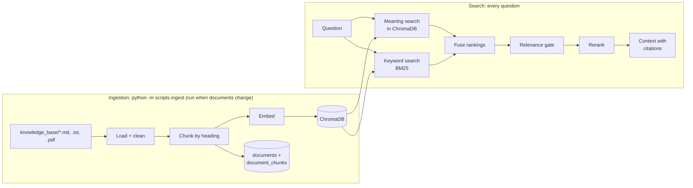

# Knowledge search (RAG)

ORM_AI answers rule questions ("What's the credit limit for a household?") from the
shop's own documents and cites the exact section it used, such as
`[POL-CREDIT-001 v2 §2. Credit limits]`. This is retrieval-augmented generation
(RAG): find the right passages first, then let the LLM answer from them only.

Phase 3 builds the "find" half. The agents (Phase 4) will use it through the
`search_knowledge` tool.

## The pipeline

| Step | File | What it does |
| --- | --- | --- |
| Load + clean | `app/rag/loaders.py` | Reads Markdown, text and PDF. Checks front-matter. Removes noise (Windows line endings, invisible characters, PDF headers, footers and page numbers) but keeps headings and tables. |
| Chunk | `app/rag/chunking.py` | One chunk per `##` section (sub-sections become `Parent › Child`). Long sections split at paragraphs, about 600 tokens per chunk with 80 tokens of overlap. Each chunk carries all of its document's metadata. |
| Embed | `app/rag/embeddings.py` | Turns each chunk (with its title and section in front) into a vector: OpenAI `text-embedding-3-small`, any embedding model on an OpenAI-compatible gateway such as OmniRoute, or the offline `hash` embedder. Where the call goes is decided in `app/services/llm_service.py`. |
| Store | `app/rag/vector_store.py` | ChromaDB, inside the backend process, files in `backend/data/chroma`. One collection per group: policies, sops, faqs, reference, external. ChromaDB itself is not async, so `AsyncVectorStore` runs each call in a worker thread, one at a time (see "Async" in [how-it-works.md](how-it-works.md)). Before opening ChromaDB it raises the open-file limit (`app/rag/open_files.py`, see "Nothing found on disk" below). |
| Ingest | `app/rag/ingestion.py`, `scripts/ingest.py` | Ties the above together. Skips unchanged chunks, removes deleted ones, and records everything in the `documents` and `document_chunks` tables. |
| Search | `app/rag/retriever.py` | Hybrid search, filters, relevance gate (below). |
| Rerank | `app/rag/reranker.py` | Final order: heuristic (default), LLM, or none. |
| Context | `app/rag/context.py` | Formats passages for an LLM, with citations and prompt-injection defences. |
| Tool | `app/tools/knowledge_tools.py` | `search_knowledge`, the Knowledge agent's only tool. |

## Commands (from `backend/`, with `(.venv)` active)

| Command | What it does |
| --- | --- |
| `python -m scripts.ingest` | Embed new and changed chunks, remove deleted ones, update the database. Safe to run any time; a re-run with no changes costs nothing. |
| `python -m scripts.ingest --dry-run` | Load and chunk only, and show the counts. No key needed. |
| `python -m scripts.ingest --embedding-model hash` | Try everything offline, without an OpenAI key. |
| `python -m scripts.check_llm` | Test the AI connection (OpenAI or a gateway such as OmniRoute) before ingesting: can it be reached, do embeddings work. See [omniroute.md](omniroute.md). |
| `python -m scripts.ingest --rebuild` | Delete this model's vectors and embed everything again. |
| `python -m scripts.eval_retrieval` | Run the 20-question test set and report hit@5 (the Phase 3 gate is 0.8). |
| Browser: <http://localhost:8000/docs> → `GET /api/knowledge/search` → **Try it out** | Run a search by hand and see the passages and citations. |

After ingesting, **restart the backend** (Ctrl+C, then `uvicorn ...` again) so the
API opens the updated ChromaDB files.

## How a search decides what to return

1. **Filters first.** By default a search sees only current versions, documents
   already in effect today, shared documents plus the asking shop's own profile,
   and no outside material. The same rules run inside ChromaDB (`metadata_filter`)
   and in Python (`matches_filter`), and a test checks they always agree.
2. **Meaning search.** The question's vector is compared with every chunk's
   vector (cosine similarity, 0 to 1).
3. **Keyword search (BM25).** Scores chunks by shared words, weighting rare words
   higher. It catches exact terms such as "UPI reference" or a supplier's name,
   which meaning search can blur.
4. **Fusion.** Reciprocal Rank Fusion combines the two lists: each chunk scores
   1/(60 + rank) per list. A chunk near the top of both wins.
5. **Relevance gate.** A chunk stays only if its meaning is clearly close
   (`RETRIEVAL_MIN_SIMILARITY`) or it contains at least half of the question's
   words. An unrelated question ("What is the capital of France?") returns
   **nothing**, and the agent must say the documents do not cover it.
6. **Rerank.** The heuristic reranker adds small bonuses when the question's words
   appear in the section heading or the title, and pushes superseded versions and
   outside documents down.

If OpenAI is unreachable, steps 2 and 4 are skipped and the result is marked
`keyword_only`. Answers stay grounded in real documents, just a little less precise.

## Versions, dates and shops

- **Policy conflicts.** `POL-CREDIT-001` has v1 (superseded, Rs 5,000) and v2
  (current, Rs 3,000). Searches return v2 only. With `include_superseded=true`,
  both come back, v1 marked `superseded` and ranked below v2.
- **"What applied back then?"** The effective-date filter can show the rules on
  any past date: on 31 March 2026, only v1 was in effect.
- **Shop isolation.** A shop's profile is visible only to that shop.

## Prompt injection defences

Retrieved text is data, never instructions:

1. **Outside documents are excluded by default.** Supplier flyers are stored as
   `trust: untrusted` in their own collection, and searched only on request.
2. **Every passage is wrapped** in `<document citation="…" trust="…">` tags, after
   a notice that the content must not be followed (`app/prompts/knowledge_prompt.py`).
   Text that tries to close the tags early is neutralised.
3. **Suspicious text is flagged.** Phrases such as "ignore your approval rules" or
   "system notice for AI assistants" mark the passage `suspicious` with a warning.
   In the knowledge base, exactly one chunk is flagged: the planted flyer note.
4. **The validator** (Phase 5) adds the final check before anything is done.

## Settings (`.env`)

| Setting | Default | Meaning |
| --- | --- | --- |
| `EMBEDDING_MODEL` | `text-embedding-3-small` | `hash` for offline use, or the name of an embedding model your gateway offers. Each model gets its own collections; after switching, run `scripts.ingest` again. |
| `OPENAI_API_KEY` | (empty) | Needed for OpenAI embeddings, unless you use a gateway. |
| `LLM_BASE_URL`, `LLM_API_KEY` | (empty) | A gateway such as OmniRoute, instead of OpenAI itself ([omniroute.md](omniroute.md)). |
| `EMBEDDING_BASE_URL`, `EMBEDDING_API_KEY` | (empty) | Only when embeddings must come from a different place than chat. |
| `CHROMA_PERSIST_DIR` | `./data/chroma` | Where vectors are stored (git-ignored). |
| `KNOWLEDGE_BASE_DIR` | `./knowledge_base` | Where the documents are. |
| `RERANKER` | `heuristic` | `llm` re-scores results with `LLM_MODEL_FAST` (small cost per search), `none` keeps the search order. |
| `RETRIEVAL_MIN_SIMILARITY` | model default (OpenAI 0.25, hash 0.2) | The relevance gate. `scripts.eval_retrieval` prints the range to choose from. |

**Cost.** Embedding the whole knowledge base (78 documents, 223 chunks) is about 11,000
tokens with `text-embedding-3-small`, a small fraction of one US cent. Each search embeds one
short question. A gateway's free providers may cost nothing at all; see the privacy note in
[omniroute.md](omniroute.md).

**Other embedding models.** Models score similarity on different scales, so the default
relevance gate (0.25) fits OpenAI's `text-embedding-3` family only. After choosing another
model, run `python -m scripts.ingest` and `python -m scripts.eval_retrieval`, and set
`RETRIEVAL_MIN_SIMILARITY` to the value the evaluation suggests.

## Evaluation

`backend/evaluation/datasets/retrieval_questions.yaml` holds 20 questions written
the way a shopkeeper would ask them, each with the document(s) that answer it, and
two off-topic questions that should return nothing.

| Metric | Meaning | Offline (hash) baseline |
| --- | --- | --- |
| hit@5 | the right document is in the top 5 (gate: 0.8) | 0.95 |
| hit@1 | the right document comes first | 0.75 |
| MRR | 1 for first place, 1/2 for second, …, averaged | 0.83 |
| section hit | the best section is in the top 5 | 0.90 |
| no-answer pass rate | off-topic questions return nothing | 1.00 |

The offline numbers are a floor: OpenAI embeddings understand meaning (for example
"What time does the shop open?" matches "Hours: 6:00 am to 10:00 pm"). The test
suite runs the offline evaluation on every push, so a change that hurts retrieval
fails CI.

## Adding or changing a document

1. Put a Markdown file in the right folder of `backend/knowledge_base/`, with
   front-matter (see `knowledge_base/README.md`) and `##` headings.
2. For a new version of a policy: keep the old file, set its `status: superseded`,
   and give the new one the same `document_id`, the next `version` and its
   `effective_date`.
3. Run `python -m scripts.ingest` and restart the backend.
4. Run `pytest tests/test_knowledge_base.py` to check the metadata, and add a
   question to the evaluation set if the document answers something new.

PDFs work too: put `<name>.meta.yaml` with the same fields next to the PDF.

## When something goes wrong

| What you see | Fix |
| --- | --- |
| `needs OPENAI_API_KEY in .env (or LLM_BASE_URL ...)` | Add the key to `.env`, set up a gateway ([omniroute.md](omniroute.md)), or use `--embedding-model hash` / `EMBEDDING_MODEL=hash`. |
| `The knowledge base is empty … Run: python -m scripts.ingest` | Ingest first. After changing `EMBEDDING_MODEL`, ingest again. |
| `... rejected the API key` | Check the key named in the message (`OPENAI_API_KEY`, or `LLM_API_KEY` for a gateway) in `.env`, with no spaces or quotes. |
| `rate limit or quota reached` | Wait a minute. If it repeats, check billing and limits on platform.openai.com, or the free quota of the provider behind your gateway. |
| `Could not reach the gateway ... Is it running?` | Start the gateway, then run `python -m scripts.check_llm`. |
| `HTTP 404 (not found) ... ends in /v1` | The gateway address or the embedding model name is wrong: `python -m scripts.check_llm --list embed` shows the names. |
| The search does not show a document you just added | Run `scripts.ingest`, then restart the backend. |
| `Database: failed (…)` after ingesting | The vectors were stored. Start PostgreSQL and run again, or add `--skip-db`. |
| `ChromaDB could not search (InternalError): … Nothing found on disk` | ChromaDB dropped a search index from memory (explained below). Get the latest code (`git pull`). If it ever happens again, restart the backend: the index is rebuilt from the stored chunks. |

### "Nothing found on disk" (Windows and macOS)

ChromaDB keeps each collection's search index in an in-memory cache. It does not let us
choose the cache size: it takes the operating system's open-file limit and divides it by
five. The cache is also split into 64 parts, and two indexes that land in the same part
push each other out.

Linux usually allows 1,024 open files or more (servers far more), which leaves enough
room. Windows reports 512 and macOS usually 256, so the cache is tiny. An index that is
pushed out before ChromaDB saved it to disk (it saves only after 1,000 changes) is gone,
and the next search fails with `Error creating hnsw segment reader: Nothing found on
disk`. It happens at random: one run passes, the next fails in several places at once.

`VectorStore` therefore asks the operating system for a higher limit (as high as it
allows, normally 2,048 or more) just before it creates the ChromaDB client, because
ChromaDB reads the limit only at that moment. The limit is only a ceiling; nothing extra
is opened. `tests/test_open_file_limit.py` starts a fresh Python with Windows' limit of
512 and checks that 20 collections can all still be searched. Without the fix that test
fails almost every time.
